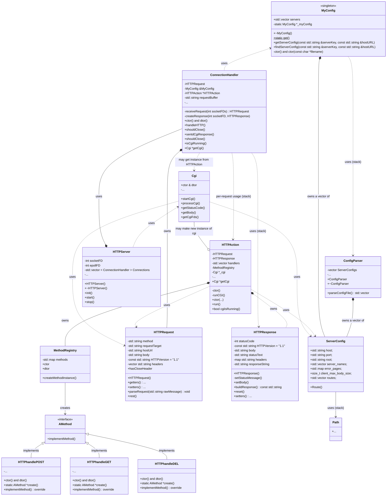

# Webserv

webserv is a simple HTTP web server it support multiple virtual hosts configured via a .conf file.
file.conf is based on ...
# use

```bash
make
./webserv {file.conf}  
```

# test

To test our process, start the server using the test configuration file or execute the following curl command:

```bash
make
./webserv {file.conf}  
```

// TODO 
```bash
./webserv users/multipleServers.conf

curl -H "Host: lol" http://localhost:8080
curl -H "Host: test" http://localhost:8080
``` 


